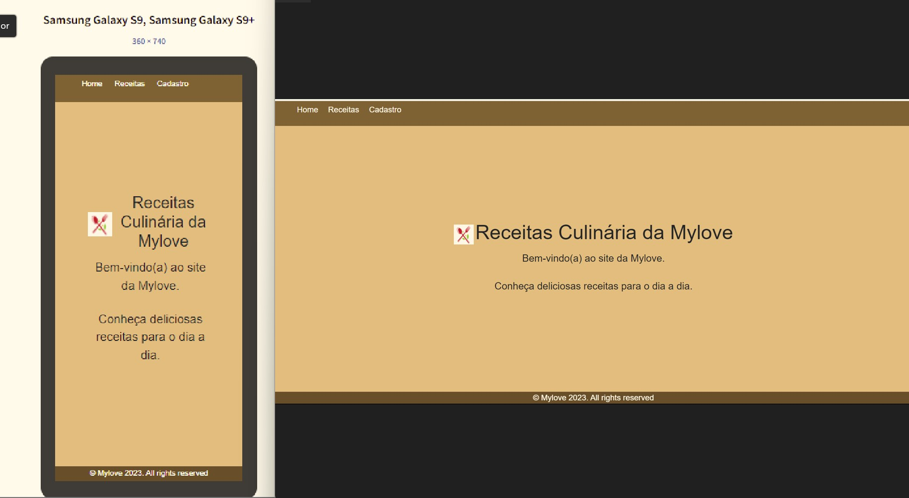
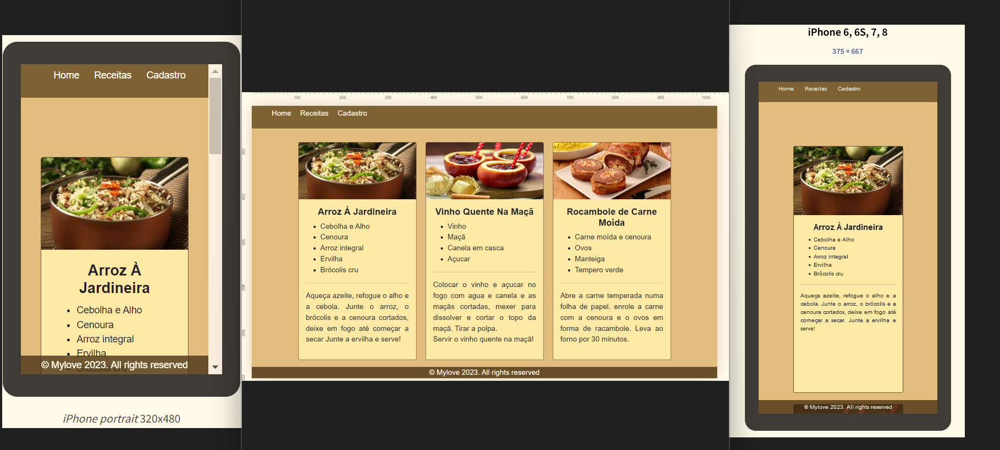
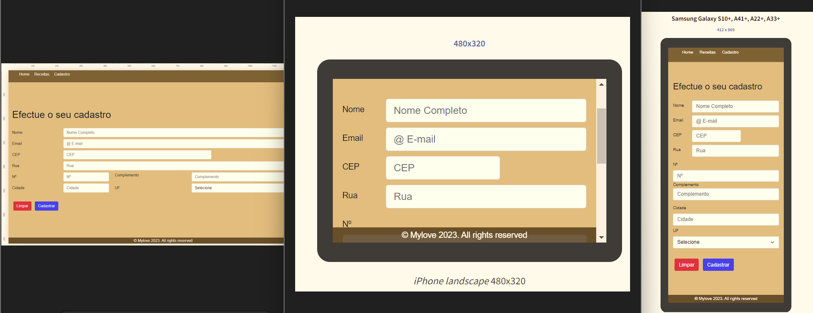

# 

# RPG0008 Meu Primeiro Site Cringe

---

Missão prática do primeiro nível de conhecimento do 2º Mundo do Curso Full-Stack da Universidade Estácio.

🔗 [Project](#-project) - [Descriptions](#-descriptions) - [Objective](#-objective) - [Lightweight](#-lightweight) - [Download](#-download) - [Install](#-install) - [Property](#property) - [License](#licence).

---

## 📋 Project

Implementação de um site voltado para o fornecimento de `Receitas Culinárias` com a utilização apenas `HTML` e ``CSS``, utilizando os elementos do Framework Bootstrap, uma `Missão Prática` do curso de `Desenvolvimento Full-Stack`da `Universidade Estacio de Sá`do `2º Mundo`do semestre de `2023.2`.

---

## 📝 Description

Para facilitar a implementação deste projeto nós precisamos:

- Criar um objetivo especifico.
- Materiais necessários para a prática.
- Metodologia de Desenvolvimento da Prática.

---

## 💼 Objective

O nosso propósito é desenvolver e manter a capacidade de criar e implementar um site que seja `responsivo`.
Considerando os objetivos listados:

1. Definir a estrutura do site na `Sintaxe HTML`.
2. Utilizar folhas de estilo `CSS` na formatação das páginas.
3. Definir uma fonte de dados estática, no próprio `HTML`.
4. Utilizar elementos básicos de formatação com o `FrameworkElement` `Bootstrap`.

---

## 🛠 Lightweight

Para atingirmos o nosso objetivo, recomendamos os seguintes tópicos:

|Tecnologias| Atributos|
|----------------|-----------------|
| Computador | Com acesso à Internet|
| Visual Studio Code | Editor de Código |
| HTML CSS JavaScript | Linguagens|
| Navigador de Internet | Chrome ou Firefox|
| Bootstrap | Framework Front-End |

Segue os links para baixar as tecnologias que foram utilizadas:

   &nbsp;

---

## 

## 📩 Download

Os arquivos deste repositories ficará no meu portifólio.

Acesse a imagem a seguir para realiza o download do Github, escolha o seu sistema operacional, em seguida, siga as
instruções para instalar o programa.

---

## 📉 Install

Acessa o link do repositório → [Meu Primeiro Site Cinge](https://github.com/Myloveken/Primeiro-site-cringe.git)
acessar a guia do`Arquivo`clica em`code`escolhe a opção desejada para`clonar o repositorio`.
`Open with Github Desktop Open with Visual Studio ou Download ZIP`

 Observação:  A melhor opção é a copiar do link HTTPS para fazer a instalação ou clonar um arquivo no github.

 ---

## 🔎 Meus exemplos de procedimento

### 1º Procedimento:

 Página Inicial - Menu - Home

A estrutura deste site foi definida de forma básica com `HTML5` a linguagem para `pt-br`os elementos `semânticos`com uma imagem de `logotipo próprio` e a área de `rodapé`incluido a informação de `copyright` etc.

### 2º Procedimento:

Página de Receitas

As receitas foram apresentas em `div`, organizadas no modo `flex` utilizando a barra de rolagem `vertical` `responsivo`.

### 3º Procedimento:

Página do cadastro

As outras páginas foram modificadas para acrescentar o codigo do menu incluindo o `bootstrap`na folha de estilos.

## 👩‍💻 Property

Este repositório desenvolver por
|Autora|Matricúla|
|----------------|----------------|
| Kenlove Chereste |202303003791||

## 🔐 License

License by MIT

Copyright (c) 2023 Kenlove Chereste

## 🌹 Informação e Agradecimento

Agradeço ao meu tutor `Claudio Piccolo Fernandes` pelo conhecimento.
Os `visitantes` sejam bem vindo(as).

O matérial de apoio e o plano de ensino se encontra-se na pasta de apoio.

Para mais informação entre em contato com a administração da `Estacio` o comigo.
